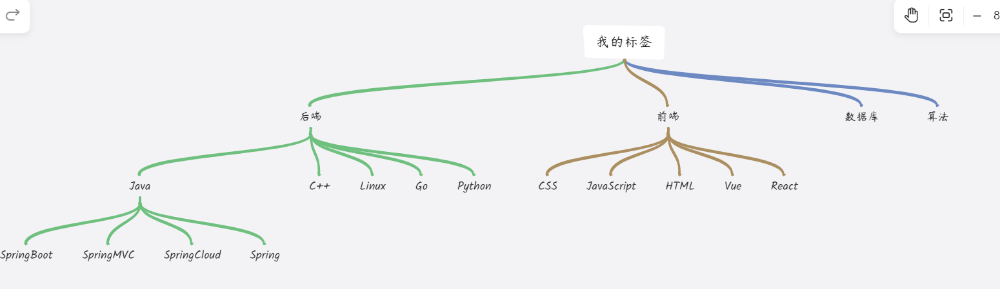
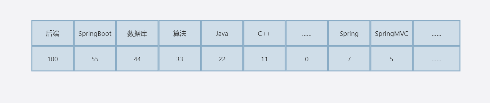
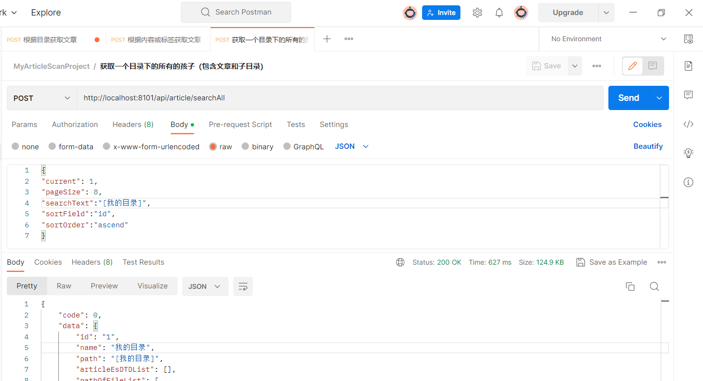
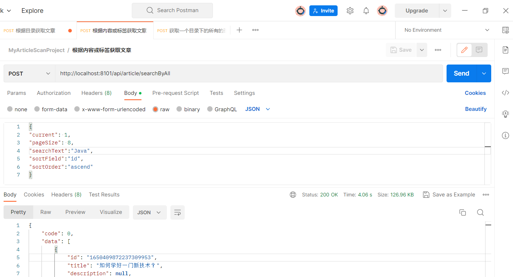

# 功能汇总
## 导出文章
> 感觉我对这个功能的理解不到位，或许是技术差的原因吧！我不太理解，导出文章，以什么形式导出呢？

来说说我获取数据的方法吧：在网页中发送请求，获取到数据，将数据粘贴到我的项目中，然后使用Hutool工具对其进行分析，处理数据为我数据库中可以存储的数据，存储到数据库中

## 打标签
其实我获取到的数据中是有tags字段的，所以刚开始的时候，无法理解这个功能存在的意义，所以就没有重视，之后在设计的过程中，发现题目的要求是根据文章内容进行打标签，而且是根据其进行归档，才开始重新构思，来实现打标签的功能
在实现的时候，我就考虑过，既然要根据其归档，那么就像我们电脑的文件夹一样应该有路径，而且得将分析出来的数据，存放到该路径之下，所以考虑到啦使用Redis中的List数据结构来实现，但是经过了一系列的设计和分析，发现这个并不能实现，所以就想到了数据结构中的树，制定出了“个性化”的标签树（目录树）如下👇</br>


### 实现方式
通过对content（内容）字段分析，依照我标签树中的标签，利用Java中最原始的模式匹配，来计算出现的最多的前6个标签（或者更少）作为该文档的标签


## 归档
   找出出现次数最多的标签，先将文档归档在这个大目录之下，如果文章内容中有出现子目录中的字段，再将其细分到子目录下（看不懂是吧，我也看不懂）<br/>
   例如：
   我得到的一篇文章中标签出现的次数如下：

   1. 选出出现的最大的一个标签：后端，目前归档到了[我的目录，后端]
   2. 遍历后端之下的目录树：后端之下有Java和C++等，其它都是0，除了Java和C++，但是Java比C++出现 的次数多，选C++，目前归档到了[我的目录，后端，java]
   3. 遍历Java之下的目录树，发现SpringBoot和Spring等都出现了，但是SpringBoot出现的次数最多，归档到[我的目录,后端,Java,SpringBoot]中去！
   4. 遍历Java之下的目录树，发现为空了，则没有子目录了，则该文档的目录为[我的目录,后端,Java,SpringBoot]<br/>
说到这不得不提目录树的结构了(至于为什么不用@Data是因为，使用它打印出来的字符，观察起来不方便)
   
```java
public class DirectoryVO {
    /**
     * 目录名称
     */
    private String dirName;
    /**
     * 子目录或者文件
     */
    private List<DirectoryVO> children;

    public DirectoryVO(String name,List<DirectoryVO> obj){
        this.dirName = name;
        this.children = obj;
    }

    public void setChildren(List<DirectoryVO> children) {
        this.children = children;
    }

    public void setDirName(String dirName) {
        this.dirName = dirName;
    }

    public List<DirectoryVO> getChildren() {
        return children;
    }

    public String getDirName() {
        return dirName;
    }

    @Override
    public String toString() {
        return
                "dirName='" + dirName + '\'' +
                ", children=" + (children.isEmpty()?null:children) ;
    }
}
```
## 搜索
当然是使用新学的Elasticsearch了，我本来想，前端写一个类似于语雀的目录结构，但是又怕时间不够了（技术不行），就先欠着（如果有鱼友愿意，我们可以合作一下呀~）
目前查询功能已经实现：
### 按照目录查询数据
返回数据如下：
按照目录查询是精确查询：本来想着前端点击某个目录，我就发送其下的文件和子目录，但是前端页面没有实现，看起来就很难受<br/>
其中的id表示当前目录的等级，简单理解就是我目录树中的第几层，这里可以结合我的目录树来看；name表示该目录的名字；path就是该目录的路径；articleEsDTDList该目录之下的文章；pathOfFileList该目录之下的子目录
每个目录之下都有子目录和文章（想象一下我们的电脑目录结构）<br/>
先看一下我构造的类吧~
```java
/**
 * 表示某个路径下的所有的文件包括文件夹
 */
@Data
public class PathOfFile implements Serializable {
    /**
     * 表示该目录在目录树的第几层
     */
    private String id ;

    /**
     * 该目录的名字
     */
    private String name;

    /**
     * 该文件夹的路径
     */
    private String path;

    /**
     * 该目录之下的所有的文章（是文章不是目录）
     */
    private List<ArticleEsDTD> articleEsDTDList;

    /**
     * 该目录之下的所有的目录
     */
    private List<PathOfFile> pathOfFileList;


    private static final long serialVersionUID = 1L;
}
```

```json
{
    "code": 0,
    "data": {
        "id": "1",
        "name": "我的目录",
        "path": "[我的目录]",
        "articleEsDTDList": [],
        "pathOfFileList": [
            {
                "id": "2",
                "name": "后端",
                "path": "[我的目录, 后端]",
                "articleEsDTDList": [],
                "pathOfFileList": [
                    {
                        "id": "3",
                        "name": "Java",
                        "path": "[我的目录, 后端, Java]",
                        "articleEsDTDList": [],
                        "pathOfFileList": [
                            {
                                "id": "4",
                                "name": "SpringBoot",
                                "path": "[我的目录, 后端, Java, SpringBoot]",
                                "articleEsDTDList": [],
                                "pathOfFileList": null
                            },
                            {
                                "id": "4",
                                "name": "SpringMVC",
                                "path": "[我的目录, 后端, Java, SpringMVC]",
                                "articleEsDTDList": [],
                                "pathOfFileList": null
                            },
                            {
                                "id": "4",
                                "name": "Spring",
                                "path": "[我的目录, 后端, Java, Spring]",
                                "articleEsDTDList": [
                                    {
                                        "id": "1650410097194610690",
                                        "title": "报培训机构还是自学？",
                                        "description": null,
                                        "content": "这可能是很多同学都关心的问题，比如下面这位小伙伴的提问：\n\n> 鱼皮哥，我是一个普通 2 本的大三学生，我的学习方向是java后端开发，堂之外的知识。",
                                        "category": "文章",
                                        "cover": null,
                                        "createtime": "2023-04-24T08:03:24.000+00:00",
                                        "updatetime": "2023-05-07T00:36:50.000+00:00",
                                        "tags": "[Java, 后端, Spring, C++, 前端, SpringBoot]",
                                        "path": "[我的目录, 后端, Java, Spring]",
                                        "highLight": null
                                    },
                                    {
                                        "id": "1650410227037679618",
                                        "title": "如何给自己制定学习目标和计划？",
                                        "description": null,
                                        "content": "学任何东西都一样，有目标是很重要……有所改变，共勉。",
                                        "category": "文章",
                                        "cover": null,
                                        "createtime": "2023-04-24T08:03:55.000+00:00",
                                        "updatetime": "2023-05-07T00:36:25.000+00:00",
                                        "tags": "[Java, 后端, C++, 前端, 简历, Spring]",
                                        "path": "[我的目录, 后端, Java, Spring]",
                                        "highLight": null
                                    }
                                ],
                                "pathOfFileList": null
                            }
                        ]
                    },
                    {
                        "id": "3",
                        "name": "C++",
                        "path": "[我的目录, 后端, C++]",
                        "articleEsDTDList": [
                            {
                                "id": "1650409872237309953",
                                "title": "如何学好一门新技术？",
                                "description": null,
                                "content": "> by 程序员鱼皮，[编程导航知识星球出品，欢迎加入]",
                                "category": "文章",
                                "cover": null,
                                "createtime": "2023-04-24T08:02:31.000+00:00",
                                "updatetime": "2023-05-06T09:09:38.000+00:00",
                                "tags": "[C++, Vue, Java, 实习, 后端, SpringBoot]",
                                "path": "[我的目录, 后端, C++]",
                                "highLight": null
                            },
                            {
                                "id": "1650432050454376449",
                                "title": "企业项目研发流程",
                                "description": null,
                                "content": "> 一线大厂的项目研发流程分享，帮助大家快速了解一个项目是如何从想法到落地上线的。\n\n\n\n大家好，我是鱼皮。\n\n\n\n很多未工作过的小伙伴都很好奇：企业中做项目是怎样的流程？尤其是大厂那些百万用户的别可大了！**\n\n\n\n",
                                "category": "文章",
                                "cover": null,
                                "createtime": "2023-04-24T09:30:39.000+00:00",
                                "updatetime": "2023-05-06T14:05:28.000+00:00",
                                "tags": "[C++, 前端, 数据库, Java, 后端, 实习]",
                                "path": "[我的目录, 后端, C++]",
                                "highLight": null
                            },
                            {
                                "id": "1650433638489174017",
                                "title": "简历项目亮点收集",
                                "description": null,
                                "content": "> by [程序员鱼皮知识星球](https://yupi.icu)，请勿对外公开！！"
                                "cover": null,
                                "createtime": "2023-04-24T09:36:57.000+00:00",
                                "updatetime": "2023-05-06T08:25:02.000+00:00",
                                "tags": "[C++, Spring, 后端, 前端, 数据库, Java]",
                                "path": "[我的目录, 后端, C++]",
                                "highLight": null
                            },
                            {
                                "id": "1650433961396056066",
                                "title": "如何获取求职信息？",
                                "description": null,
                                "content": "重点推荐几个找实习或工作的渠道：\n\n1）实习僧，了解企业规模和可信度",
                                "category": "文章",
                                "cover": null,
                                "createtime": "2023-04-24T09:38:14.000+00:00",
                                "updatetime": "2023-05-06T01:09:01.000+00:00",
                                "tags": "[C++, 实习, Java, CSS, Vue, Go]",
                                "path": "[我的目录, 后端, C++]",
                                "highLight": null
                            }
                        ],
                        "pathOfFileList": null
                    },
                    {
                        "id": "3",
                        "name": "Linux",
                        "path": "[我的目录, 后端, Linux]",
                        "articleEsDTDList": [],
                        "pathOfFileList": null
                    },
                    {
                        "id": "3",
                        "name": "Go",
                        "path": "[我的目录, 后端, Go]",
                        "articleEsDTDList": [],
                        "pathOfFileList": null
                    },
                    {
                        "id": "3",
                        "name": "Python",
                        "path": "[我的目录, 后端, Python]",
                        "articleEsDTDList": [],
                        "pathOfFileList": null
                    }
                ]
            },
            {
                "id": "2",
                "name": "前端",
                "path": "[我的目录, 前端]",
                "articleEsDTDList": [],
                "pathOfFileList": [
                    {
                        "id": "3",
                        "name": "CSS",
                        "path": "[我的目录, 前端, CSS]",
                        "articleEsDTDList": [],
                        "pathOfFileList": null
                    },
                    {
                        "id": "3",
                        "name": "JavaScript",
                        "path": "[我的目录, 前端, JavaScript]",
                        "articleEsDTDList": [],
                        "pathOfFileList": null
                    },
                    {
                        "id": "3",
                        "name": "Vue",
                        "path": "[我的目录, 前端, Vue]",
                        "articleEsDTDList": [],
                        "pathOfFileList": null
                    },
                    {
                        "id": "3",
                        "name": "React",
                        "path": "[我的目录, 前端, React]",
                        "articleEsDTDList": [],
                        "pathOfFileList": null
                    }
                ]
            },
            {
                "id": "2",
                "name": "数据库",
                "path": "[我的目录, 数据库]",
                "articleEsDTDList": [],
                "pathOfFileList": null
            },
            {
                "id": "2",
                "name": "算法",
                "path": "[我的目录, 算法]",
                "articleEsDTDList": [],
                "pathOfFileList": null
            },
            {
                "id": "2",
                "name": "实习",
                "path": "[我的目录, 实习]",
                "articleEsDTDList": [],
                "pathOfFileList": [
                    {
                        "id": "3",
                        "name": "简历",
                        "path": "[我的目录, 实习, 简历]",
                        "articleEsDTDList": [
                            {
                                "id": "1650433438420873217",
                                "title": "程序员写简历指南（保姆级）",
                                "description": null,
                                "category": "文章",
                                "content":"马卡马卡",
                                "cover": null,
                                "createtime": "2023-04-24T09:36:09.000+00:00",
                                "updatetime": "2023-05-06T07:25:45.000+00:00",
                                "tags": "[简历, C++, 后端, 前端, Java, 数据库]",
                                "path": "[我的目录, 实习, 简历]",
                                "highLight": null
                            },
                            {
                                "id": "1650434235984556033",
                                "title": "什么时间投递简历？",
                                "description": null,
                                "content": "### 校招\n\n对于还在校园的小伙伴，一般情况"
                              "category": "文章",
                                "cover": null,
                                "createtime": "2023-04-24T09:39:20.000+00:00",
                                "updatetime": "2023-05-06T14:29:22.000+00:00",
                                "tags": "[实习, 简历, Java, C++, CSS, Vue]",
                                "path": "[我的目录, 实习, 简历]",
                                "highLight": null
                            }
                        ],
                        "pathOfFileList": null
                    }
                ]
            }
        ]
    },
    "message": "ok"
}
```


### 按照内容，标签，title查询


> 实现了高亮哦~


```json
{
    "code": 0,
    "data": [
        {
            "id": "1650409872237309953",
            "title": "如何学好一门新技术？",
            "description": null,
            "content": "> by 程序员鱼皮，[编"
          	"category": "文章",
            "cover": null,
            "createtime": "2023-04-24T08:02:31.000+00:00",
            "updatetime": "2023-05-06T09:09:38.000+00:00",
            "tags": "[C++, Vue, Java, 实习, 后端, SpringBoot]",
            "path": "[我的目录, 后端, C++]",
            "highLight": {
                "title": "",
                "content": "如果这门技术和你的岗位目标相关（比如 SpringBoot 对 <em>Java</em> 后端开发很重要），那么可以进一步了解该技术的特性，并做到熟练运用，**主动** 用该技术去解决对应的问题。"
            }
        },
        {
            "id": "1650410097194610690",
            "title": "报培训机构还是自学？",
            "description": null,
            "content": "这可能是很多同学都关心的问题，比……"
           "category": "文章",
            "cover": null,
            "createtime": "2023-04-24T08:03:24.000+00:00",
            "updatetime": "2023-05-07T00:36:50.000+00:00",
            "tags": "[Java, 后端, Spring, C++, 前端, SpringBoot]",
            "path": "[我的目录, 后端, Java, Spring]",
            "highLight": {
                "title": "",
                "content": "这可能是很多同学都关心的问题，比……"
            }
        },
        {
            "id": "1650410227037679618",
            "title": "如何给自己制定学习目标和计划？",
            "description": null,
            "content": "学任何东西都一样，…… "          
           "category": "文章",
            "cover": null,
            "createtime": "2023-04-24T08:03:55.000+00:00",
            "updatetime": "2023-05-07T00:36:25.000+00:00",
            "tags": "[Java, 后端, C++, 前端, 简历, Spring]",
            "path": "[我的目录, 后端, Java, Spring]",
            "highLight": {
                "title": "",
                "content": "学任何东西都一样，……"
            }
        }
    ],
    "message": "ok"
}
```
# 小结
这个项目我用了大概3天的时间，其中对我来说最具挑战的是:<br/>
## 树的遍历
可以这么说，我的这个项目完全的是靠算法支撑起来的。
这个真的是考验算法，还好，我解决了，用的都是递归，现在还有点爱上递归了呢！（可以看代码，逻辑挺简单的）主要代码在src\main\java\com\yupi\springbootinit\job\once\MyDirectory.java之中
## Elasticsearch的使用
虽然鱼皮在聚合搜索平台中讲过了，但是毕竟对我来说是一个新的技术，畏惧之心还是有的，反正反正目前可以简单的运用了！
## 调用演示


gitee地址：https://gitee.com/fireLh/my-article-scan.git<br/>
github地址：https://github.com/omnisciencelh/MyArticleScan.git<br/>
其实这篇文章算是我做完之后的总结，如果大家想要看详细的思路什么的，可以喊我加你为语雀文档协作者哈~

## 小小结
想告诉自己，不要着急不要着急，一定要自信，你看你都可以独立做出这么多项目了，加油啊~

